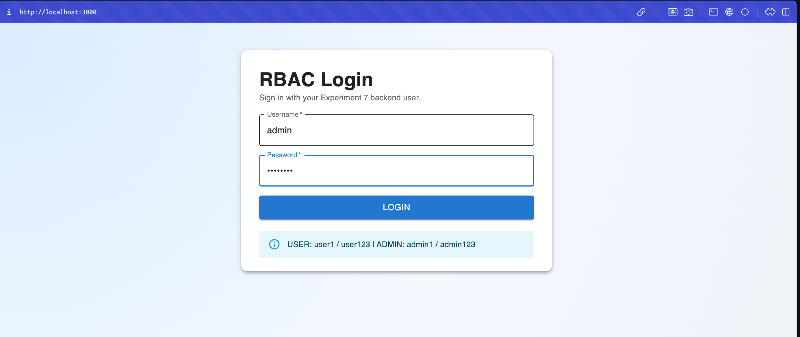
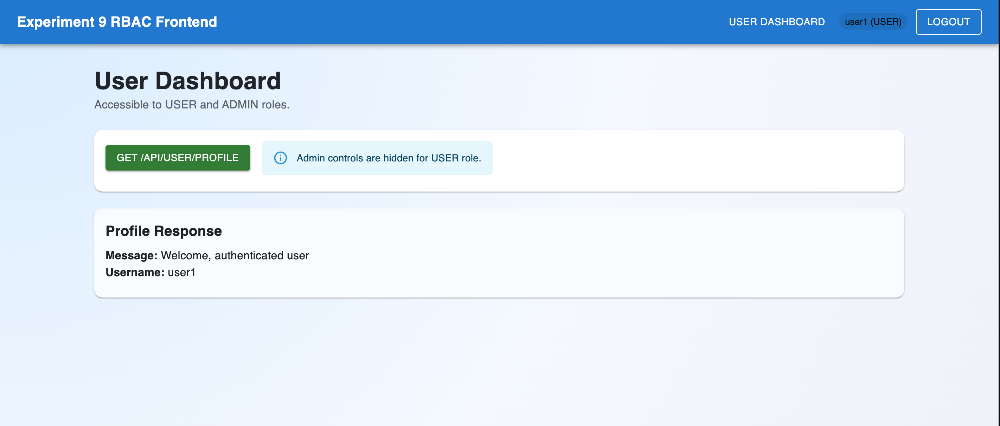
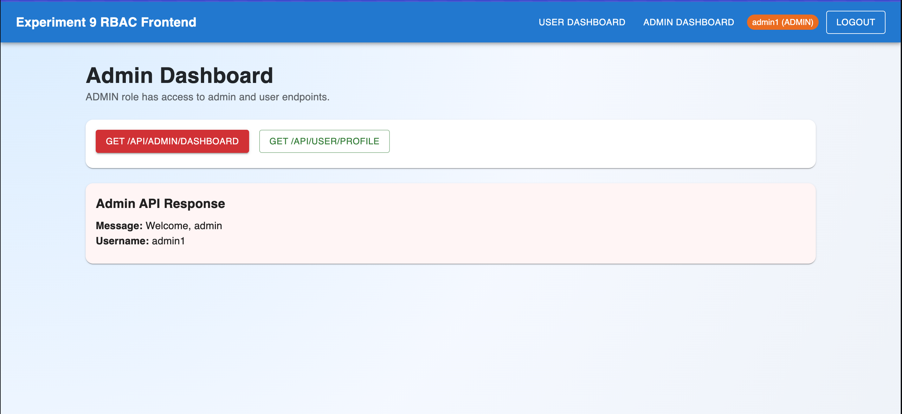
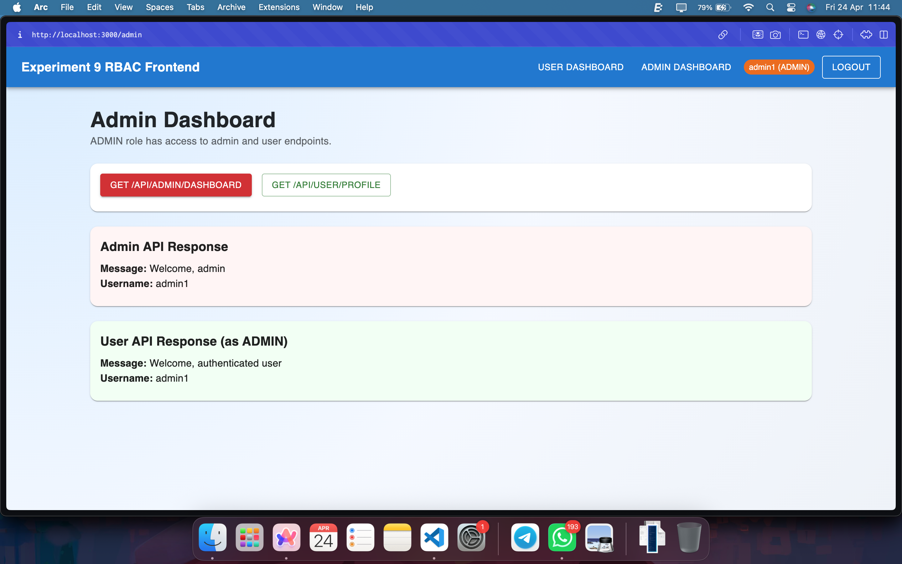

# Experiment 9 - Screenshot Documentation

This folder contains the frontend integration screenshots for **Experiment 9: Frontend Integration with RBAC (React + Session-Based UI)**.

## Backend and Frontend Context

- Backend: Spring Boot RBAC APIs (Experiment 7)
- Frontend: React + Bootstrap + Material UI
- Auth mode: Session-based UI using `sessionStorage`
- Roles tested: `USER`, `ADMIN`

## Screenshot Index

| No. | Screenshot File | What It Demonstrates |
|-----|-----------------|----------------------|
| 1 | `login.png` | Login screen UI for username/password authentication |
| 2 | `userdashboard.png` | USER role dashboard and user-level access |
| 3 | `admindashboard.png` | ADMIN role dashboard and admin-level access |
| 4 | `apiresponse.png` | API response validation for role-based endpoint behavior |

## 1. Login UI

Shows the RBAC login page where users enter credentials.



## 2. USER Dashboard Access

Shows successful access to USER-side features after login.



## 3. ADMIN Dashboard Access

Shows successful access to ADMIN-only features.



## 4. API Response Verification

Shows role-based API response behavior used to verify authorization.




This project is a React frontend for the Experiment 7 Spring Boot RBAC backend.

## Objective

- Integrate frontend with RBAC backend APIs
- Use Bootstrap + Material UI
- Implement session-based authentication with `sessionStorage`
- Restrict routes and UI controls by role (`USER`, `ADMIN`)

## Folder Structure

```text
exp9-frontend/
├── public/
└── src/
    ├── api/
    ├── components/
    │   ├── Login.js
    │   ├── UserDashboard.js
    │   ├── AdminDashboard.js
    │   ├── ProtectedRoute.js
    │   ├── Unauthorized.js
    │   └── AppShell.js
    ├── utils/
    │   └── session.js
    ├── App.js
    └── index.js
```

## Install and Run

1. Start backend (Experiment 7) at `http://localhost:8080`
2. From this folder run:

```bash
npm install
npm start
```

Frontend runs at `http://localhost:3000`.

## Environment Config

Copy `.env.example` to `.env` if needed and edit backend URL:

```env
REACT_APP_API_BASE_URL=http://localhost:8080
```

## Demo Credentials

- USER: `user1` / `user123`
- ADMIN: `admin1` / `admin123`

## Implemented Features

1. Login page

- Accepts username/password
- Calls `POST /api/auth/login`
- Stores `username`, `role`, and `authToken` in `sessionStorage`
- Redirects USER to `/user` and ADMIN to `/admin`

1. Role-based dashboards

- USER Dashboard calls `GET /api/user/profile`
- ADMIN Dashboard calls `GET /api/admin/dashboard`
- ADMIN can also call `GET /api/user/profile`

1. Role-based UI control

- Admin navigation button is shown only to ADMIN
- USER cannot see admin controls
- Direct unauthorized route access redirects to unauthorized page

1. Logout

- Uses `sessionStorage.clear()`
- Redirects to login page

## API Authorization Flow

- Auth token returned from backend login (`basicAuthToken`) is stored in session
- Axios interceptor adds `Authorization` header automatically for secured calls

## Required Screenshots Checklist

- Login UI
- USER accessing user endpoint successfully
- USER denied access to admin page (Unauthorized page)
- ADMIN accessing admin endpoint successfully
- Browser `sessionStorage` showing stored role
- Unauthorized handling example

## Notes

- This frontend assumes Experiment 7 backend is running and seeded with demo users.
- If backend URL changes, update `REACT_APP_API_BASE_URL`.
